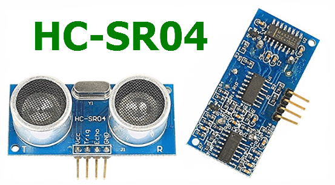

HC-SR04
============

Python library to use HC-SR04 Ultrasonic Ranging Module on Beaglebone Black

| Board pin name | Board pin | Beaglebone Black pin name |
|----------------|-----------| --------------------------|
| Vcc            | 1         | P9\_5, VDD\_5v            |
| Trig           | 2         | P9\_23, GPIO              |
| Echo           | 3         | P9\_25, GPIO              |
| GND            | 4         | P9\_1, Ground             |

